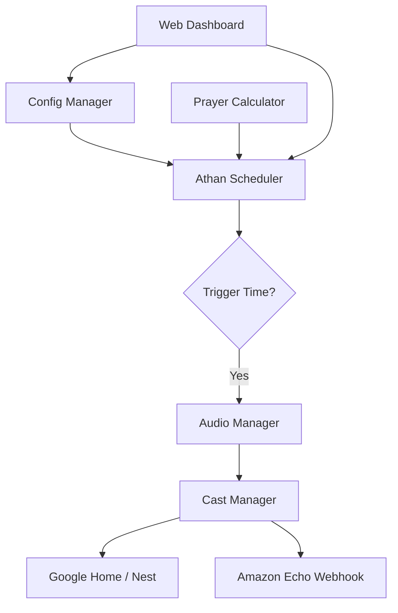

# 🌙 Home Athan Automation

[](https://www.python.org/downloads/)
[](https://opensource.org/licenses/MIT)
[](#)

A robust, local-first Athan (Adhan) automation system designed for Raspberry Pi. It intelligently calculates accurate prayer times and orchestrates playback across **Google Cast** (Home/Nest) and **Amazon Echo** devices.

---

## ✨ Key Features

-   **🎯 Precision Calculation**: Powered by `islamic-times`, supporting multiple calculation methods (ISNA, MWL, Makkah, etc.) with custom offsets.
-   **📡 Multi-Device Orchestration**: Auto-discovery and synchronized playback on Google Cast devices and Echo devices (via webhooks).
-   **🎨 Modern Dashboard**: A sleek, dark-mode web interface for real-time monitoring, countdowns, and instant configuration.
-   **🔔 Smart Reminders**: Independently configurable reminders before or after each prayer.
-   **🔒 Privacy First**: Operates entirely within your local network. No cloud dependencies for core scheduling and Google Cast control.
-   **🛠 Production Ready**: Includes a robust installation script and `systemd` service integration for 24/7 reliability.

---

## 🚀 How It Works



---

## 🛠 Tech Stack

-   **Backend**: Python 3.9+, FastAPI, APScheduler
-   **Audio logic**: islamic-times (Calculation), PyChromecast (Casting)
-   **Frontend**: Vanilla JS, Modern CSS (Glassmorphism), WebSocket updates
-   **Deployment**: Systemd, Docker, Bash

---

## ⚡ Quick Start

### 1. Installation
Connect to your Raspberry Pi and run:
```bash
git clone https://github.com/maher/Home-Athan.git
cd Home-Athan
chmod +x scripts/install.sh
./scripts/install.sh
```

### 2. Setup
1.  Access the dashboard at `http://<YOUR_PI_IP>:8000`.
2.  Set your **Latitude / Longitude** in the **Calculation** tab.
3.  Upload or select your preferred Athan files in the **Schedule** tab.
4.  Select your target speakers and hit **Save**.

---

## 📑 Documentation

-   📘 [**Deployment Guide**](file:///Users/maher/Desktop/Home-Athan/deployment_guide.md): Step-by-step guide for local and Docker deployment.
-   🏗 [**Technical Features**](file:///Users/maher/Desktop/Home-Athan/technical_features.md): Deep dive into the architecture and system logic.

---

## 🤝 Contributing
Contributions are welcome! Please feel free to submit a Pull Request.

## 📄 License
This project is licensed under the MIT License - see the [LICENSE](LICENSE) file for details.
