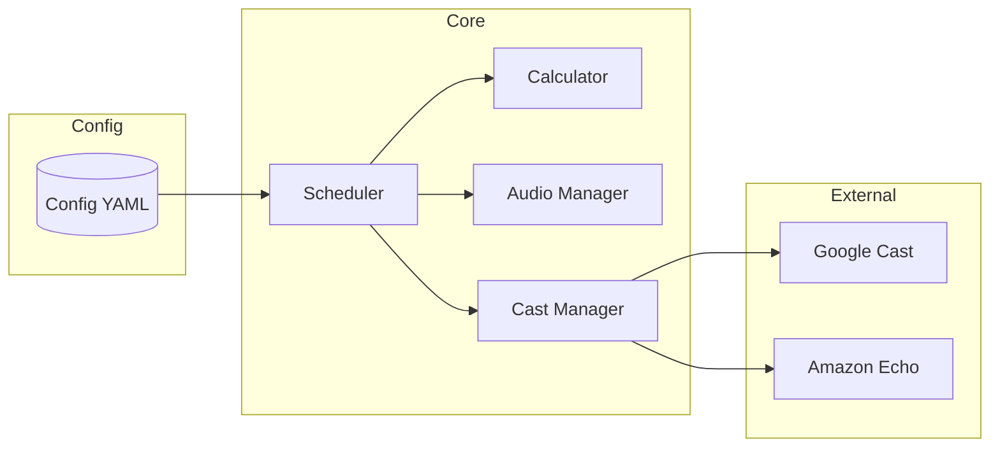

# 🏗 Technical Features & Architecture

This document provides a deep dive into the technical implementation of the **Home Athan Automation** system.

---

## 1. Core Architecture

The system is built using a modular event-driven architecture. The orchestration is managed by the `AthanScheduler`, which coordinates between specialized modules.

### Key Components:
- **`main.py`**: The entry point. Initializes the `ConfigManager`, starts the `AthanScheduler`, and launches the FastAPI web server.
- **`core/scheduler.py`**: The "brain" of the system. Uses `APScheduler` to:
    - Recalculate prayer times daily at 12:01 AM.
    - Schedule precise playback jobs for each prayer (and its optional reminders).
    - Manage active jobs and handle "Stop Audio" signals.
- **`core/calculator.py`**: Interfaces with the `adhanpy` library. Converts geographical coordinates and calculation methods into precise `datetime` objects.
- **`core/audio_manager.py`**: Handles the resolution of audio file paths, fallbacks (e.g., if a specific Athan file is missing, it reverts to the default), and directory integrity.
- **`integrations/cast_manager.py`**: Manages communication with smart speakers.
    - **Google Cast**: Uses `pychromecast` with MDNS for local discovery. It employs a resilient connection strategy, caching device objects to minimize latency.
    - **Amazon Echo**: Implements a webhook-based trigger system, allowing integration with external services like IFTTT or Home Assistant to bridge to Alexa routines.

---

## 2. Prayer Calculation Engine

The system ensures astronomical accuracy by utilizing the `adhanpy` library.

### Configuration Parameters:
- **Methods**: Supports standard methods like ISNA, MWL, Makkah, Karachi, Egypt, etc.
- **Asr Juristic Method**: Switchable between `Standard` (Shafi, Maliki, Hanbali) and `Hanafi`.
- **High Latitude Rule**: Automatically handles regions with extreme day lengths.
- **Offsets**: Every prayer can have a minute-based offset (e.g., play Athan 2 minutes before/after the calculated time).
- **Hijri Calibration**: Includes a `hijri_offset` for manual adjustment of the Islamic calendar date displayed in the UI.

---

## 3. Web Dashboard & API

The frontend is a lightweight, responsive dashboard built with modern Vanilla JS and CSS.

### Communication Flow:
- **FastAPI**: Serves the static assets and provides a RESTful API for configuration updates.
- **WebSockets**: Real-time status updates (countdown to next prayer, discovered devices, current playback state) are pushed to the client via WebSockets, ensuring zero-latency monitoring.
- **Design Pattern**: Uses a "Glassmorphism" aesthetic with a dynamic dark mode that adjusts based on the current prayer phase.

---

## 4. Audio Processing & Playback

- **Local MP3 Storage**: Audio files are stored locally in the `audio/` directory, categorized into `athan` and `reminders`.
- **Dynamic Selection**: Users can assign different Athan files to different prayers (e.g., a short Athan for Fajr and a different one for Maghrib).
- **Volume Control**: Individual volume settings for each prayer and reminder, with global fallbacks.
- **Fade-In**: Configurable fade-in effects to ensure a gentle transition for early morning prayers.

---

## 5. Deployment Reliability

- **Systemd Integration**: The system is designed to run as a supervised service, automatically restarting on failure or system reboot.
- **Logging**: Comprehensive rotating logs help in troubleshooting network issues or discovery failures.
- **Docker Support**: A multi-arch `Dockerfile` is provided for containerized deployment, ensuring environment consistency across different Raspberry Pi versions.
